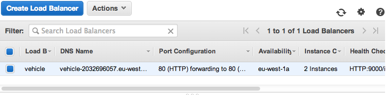

% **Przetwarzanie w chmurze**  
  System śledzenia pojazdów
% Łukasz Brewczyński; Filip Dziedzic; Michał Pałka; Rafał Studnicki 
% Informatyka   
  Wydział Elektrotechniki, Automatyki, Informatyki i Inżynierii Biomedycznej  
  Akademia Górniczo-Hutnicza im. St. Staszica w Krakowie
-----

## 1. Wprowadzenie

Celem projektu jest zaprojektowanie, implementacja oraz wdrożenie systemu umożliwiającego śledzenie i wizualizację ruchu pojazdów.

Do podstawowych komponentów systemu zaliczamy:

* aplikację mobilną, mającą za zadanie odczyt aktualnego położenia;
* serwer aplikacji, udostępniający usługi systemu;
* bazę danych;
* aplikację webową, pozwalającą na wizualizację oraz dostęp do usług za pomocą przeglądarki internetowej.

Do przypadków użycia systemu zaliczamy:

* śledzenie floty korporacyjnej;
* śledzenie pojazdów specjalnych:
    - z ustaloną wcześniej trasą (np. konwoje);
    - spedycyjne, ze znaną wcześniej trasą, śledzenie postępu realizacji zadania;
* rejestracja tras dla celów prywatnych.

## 2. Wdrożenie na stosie usług Amazon Web Services

### 2.1. Wprowadzenie

Jednym z elementów projektu z przedmiotu *Przetwarzanie w chmurze* było wdrożenie przykładowej aplikacji na jednym ze stosów technologicznych udostępniających usługi w chmurze. Wybranym przez nas zestawem usług był **Amazon Web Services**. 
Z kolei wdrażaną aplikacją był system śledzenia pojazdów składający się z aplikacji udostępniającej logikę biznesową, klienta webowego oraz klienta mobilnego.

### 2.2. Instancje EC2

Aplikacja do działania potrzebuje maszyny wirtualnej Javy w wersji przynajmniej 1.7 oraz serwera HTTP **Netty**.
Jedynym wymaganiem klienta webowego jest serwer HTTP serwujący statyczne pliki, w naszym przypadku był to **nginx**.

Zarówno **JVM** z wdrażaną aplikacją jak i **nginx** zostały uruchomione na dwóch instancjach typu **micro** EC2 w regionie EU-West zlokalizowanym w Irlandii.

Na rysunku 1 widać zrzut ekranu z panelu zarządzania uruchomionymi instancjami.

### 2.3. Elastic Load Balancer

Celem uruchomienia większej liczby instancji jest wysoka dostępność uruchomionej aplikacji. W przypadku awarii jednej z nich, druga może wziąć na siebie obsługę zapytań. W sytuacji normalnego funkcjonowania instancji, *load balancer* decyduje do której instancji przekierować zapytanie, dzięki czemu ruch jest rozłożony na więcej niż jedną maszynę.

W idealnym przypadku zatem instancje powinny być uruchomione w różnych strefach (znajdujących się w tym samym *datacenter*, jednak gwarantowana jest ich fizyczna separacha) a nawet regionach (Amazon posiada kilka *datacenter* w różnych częściach świata). W ten sposób uniezależniamy działanie aplikacji od awarii regionu czy nawet całego datacenter.

Na rysunku 2 została umieszczona lista load balancerów w panelu administracyjnym **Amazon Web Services** z load balancerem uruchomionym na potrzeby aplikacji o nazwie *vehicle*.

W panelu administracyjnym load balancera możliwe jest podglądanie i zmienianie aktualnie działających instancji w obrębie danej instancji load balancera. Przykład tego możliwy jest do zaobserwowania na rysunku 3.

Load balancer nie potrafi dokonać automatycznej oceny czy dana instancja nadaje się do obsługi ruchu przychodzącego, gdyż nawet jeśli instancja jest poprawnie uruchomiona, aplikacja może działać błędnie.

Dlatego też konieczne jest zdefiniowanie własnego interfejsu sprawdzającego czy aplikacja na danym węźle działa poprawnie. Możliwe jest zdefiniowanie jej za pomocą protokołu HTTP, HTTPS, TCP lub SSL. Dodatkowo możliwe jest zdefiniowanie czasu co jaki instancja powinna być sprawdzana, a także liczba błędnych i poprawnych odpytań z rzędu która konieczna jest do stwierdzenia, że aplikacja nie działa lub działa ponownie.

Sposób konfiguracji load balancera w naszej aplikacji został przedstawiony na rysunku 4.

Jak wspomniano zadaniem load balancera jest przekierowywanie zapytań przychodzących do load balancera do działających instancji. Możliwe jest przekierowanie połączeń w protokołach HTTP, HTTPS, TCP lub SSL.

Sposób konfiguracji przekierowań w naszym projekcie został przedstawiony na rysunku 5.

W **Elastic Load Balancerze** możliwe jest skonfigurowanie *lepkości* sesji. W przypadku przekierowań protokołu HTTP lub HTTPS funkcjonalność ta pozwala na przypisanie sesji użytkownika do danej instancji. Jest to konieczne w przypadku, gdy informacje o sesji przechowywane są tylko na docelowej instancji i nie podlegają klastrowaniu.

W **ELB** *lepkość* można skonfigurować na 2 sposoby: przez *cookie* dołączane automatycznie przez load balancer, lub *cookie* dołączane przez aplikację użytkownika. Druga opcja powinna zostać wybrana, jeśli przekazujemy identyfikator sesji właśnie w postaci ciasteczek.

W obu przypadkach klient powinien przy każdym kolejnym zapytaniu użyć zwróconych wartości *cookie*, które tracą ważność po zadanym okresie czasu.

Sposób konfiguracji *lepkości* sesji w naszym projekcie został przedstawiony na rysunku 6.

### 2.4. Relational Database Service

Komponentem wymaganym do działania przykładowej aplikacji śledzenia jest relacyjna baza danych. **Relational Database Service** zapewnia silniki bazodanowe dla MySQL, PostgreSQL, Oracle oraz Microsoft SQL Server. Wybranym przez nas silnikiem jest PostgreSQL. 

Warto dodać, że **AWS** zapewnia wysoką dostępność usługi **RDS**, dlatego też uruchomienie jednej instancji bazy danych nie jest równoważne z wprowadzeniem do systemu *Single Point of Failure*.

Podsumowanie konfiguracji uruchomionej przez nas instancji relacyjnej bazy danych zostało zaprezentowane na zrzucie ekranowym na rysunku 7.

### 2.5. Route 53

Ostatnim elementem wdrożenia aplikacji było uruchomienie strefy DNS dla wybranej przez nas domeny w usłudze **Route 53**, działającej jak serwer DNS.

Podobnie jak w przypadku usługi **RDS**, Amazon zapewnia wysoką dostępność usługi i nie ma konieczności wprowadzania nadmiarowości w celu zapewnienia wysokiej dostępności na własną rękę.

Lista wpisów DNS została przedstawiona na rysunku 8. Jak można zauważyć, wpis A domeny wskazuje na uruchomiony przez nas wcześniej load balancer.

### 2.6. Podsumowanie

Stos usług **Amazon Web Services** pozwala na uruchomienie wymaganych przez nas do wdrożenia aplikacji usług w bardzo łatwy sposób. Wszystkie funkcjonalności dostępne są z konsoli webowej (sposób używany przez nas) lub API REST.

Aplikacja kliencka będąca efektem wdrożenia dostępna jest pod adresem [http://trackme.malopolska.pl/](http://trackme.malopolska.pl/).

\newpage

## 3. Diagramy Archimate 2.0 dla systemu
